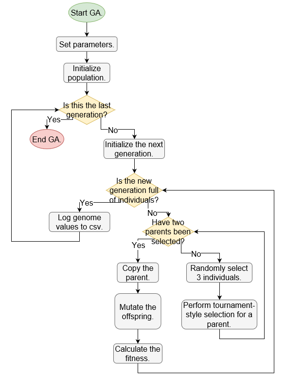
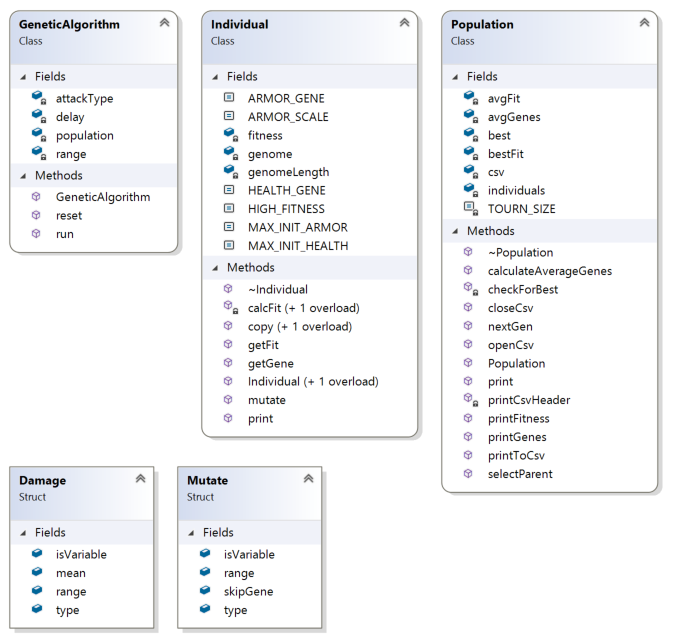
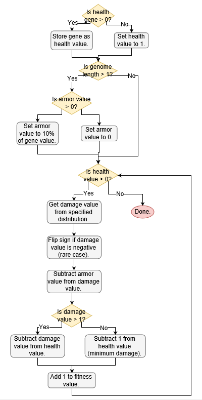

# HP Analysis

## Overview
The HP Analysis app automates the process of testing different configurations of the genetic algorithm and collecting corresponding data. It stores the results in csv files for further analysis. 

The app was developed in C++ using Visual Studio 2017. You can adjust the test runs by the project's parameters.



*Figure 1: Flowchart illustrating a run through the genetic algorithm.*

## Classes



*Figure 2: Class diagram for the project.*

### Genetic Algorithm
The methods of the Genetic Algorithm class setup and control the run of each session. These methods rely on functionality implemented in the Population and Individual classes to handle the bulk of the work.

### Population
The Population class contains functionality to initialize a population of individuals for use in the genetic algorithm. Its methods handle the higher level parameters, adapt each successive generation, and select parents from the population. The class also has some methods for calculating average values from the population's members as well as outputting those values to stdout or a csv file.

### Individual
The Individual class defines the structure of a given member of the population. The core properties are the genome and fitness value. Aside from helper methods, the class also has methods for performing uniform mutation and calculating the fitness. This fitness calculation relies on utility functions for acquiring value from uniform and Gaussian distributions.



*Figure 3: Flowchart illustrating the process of calculating an Individual's fitness.*

### Other Components
#### Utility
The util files contain a few helper methods, primarily for use when calculating the fitness. ```uniformDistDamage``` and ```gaussianDistDamage``` are used for generating values from a uniform random distribution and a Gaussian distribution, respectively. These functions are used for testing the affects of different damage types on the evolution of fitness.

#### Parameters
The params header file defines two structures for controlling the damage and mutation in a given test session.
##### Damage struct
- type: constant, uniform, or Gaussian
- mean: mean damage value for a distribution
- range: range or standard deviation of the distribution
- isVariable: boolean indicating whether the test is varying the mean damage or not

##### Mutate struct
- type: currently only uniform is supported
- range: range of the mutation
- skipGene: allows for skipping an index in the genome when performing mutation
- isVariable: boolean indicating whether the test is varying the mutation range or not
